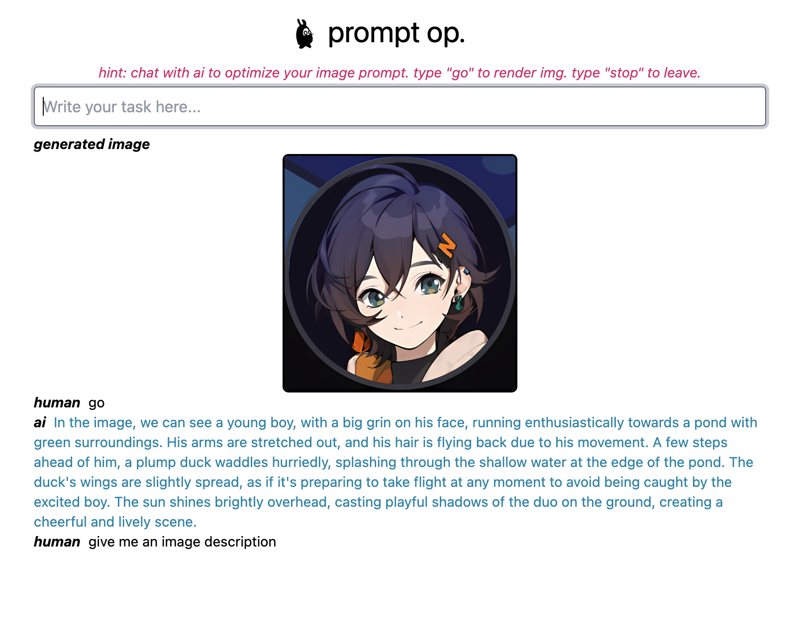
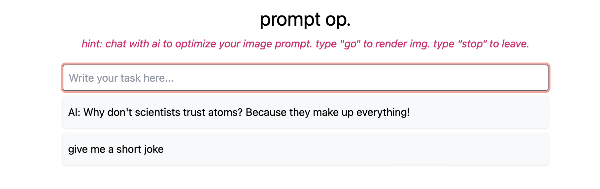

# Prompt-Optimizer

*Architecture: Deno, Flask, Python.*

## Dev Notes

Goal. Use LLM to iterate prompts for more efficient and accurate Text-Image Generation.

Plan & Progress

- ~~Use GPT to generate prompts based on initial user input.~~
- ~~Generate image with DALL-E with the prompt provided by GPT.~~
- ~~(Iteration) Use GPT to optimize prompts in an interactive way.~~
- ~~(Output Variants) Hook up with local Stable Diffusion model.~~
- ~~(Web UI) Provide a Web UI for better interaction.~~
- Enable Python Back-end with Streaming API, Vectorstore, etc.
- Improve Prompt Optimization Process. Consider Fine-turning or Prompt Engineering.
- Exploration of Model. How to evaluate prompt quality?
- Exploration of UX. Improve User Experience by Enriching UI with A/B variants, prompt variants.
- Exploration of Diffusion. Support More Advanced Image-Gen Params, such as sampling type, ControlNet, etc.

## May 20, 2023
- enabled image generation from Dall-E.
- updated UI with better image/text compatibility.
- got new ideas of python backend connection. Instead of a simple API, I'm thinking of streaming and other more advanced features. Next step, I need to focus on modeling + transformer. Will come back in around 2-3 weeks and continue the API/Back-end features.

> 

## May 19, 2023
- added initial UI with simple text generation. (Deno+Fresh)
- ~~TODO: need to add image gen.~~
- ~~TODO: need to connect with python back-end.~~

> 

## May 4, 2023
- Added Front-end on top of Node.js
- Added Back-end Flask Server.
- Set up CI Flow and Unittests.
- ~~TODO: Need to update all interfaces. They're not well connected.~~

## April 26, 2023

- Enabled local image generation based on HuggingFace Diffusers.

- Supported Stable Diffusion 2.1 and another pastel style model.

- Refactored code into separate files and relevant optimization.

### April 24, 2023

- Initial prototype ready.

- GPT can convert a user description into a prompt and send it to DALL-E.

- Image is saved on local.

- Added memotry feature. (TODO: need to consider token limitation)

> 
